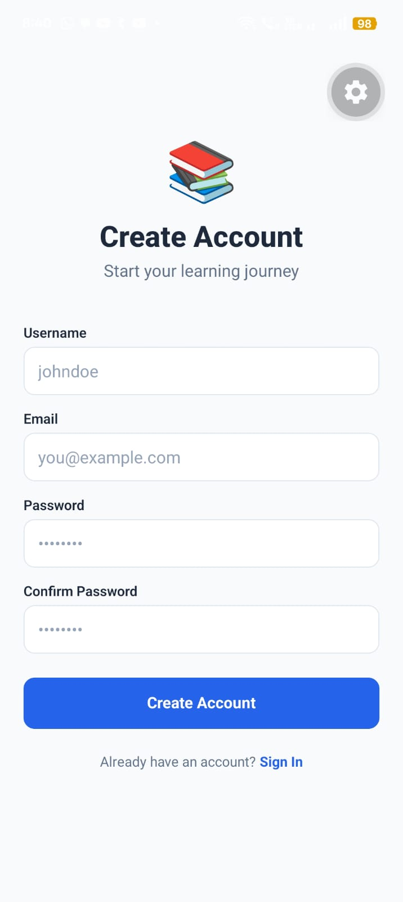
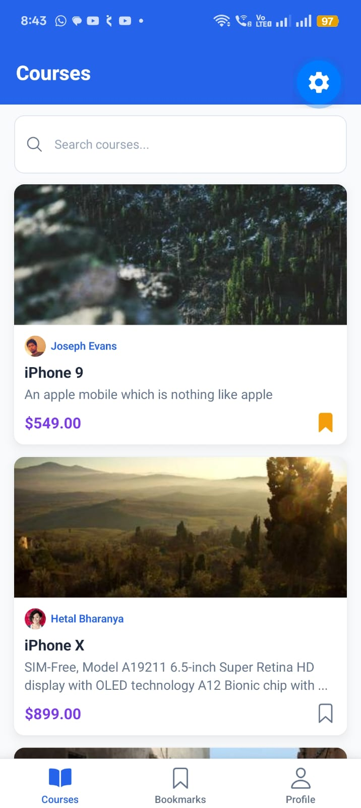
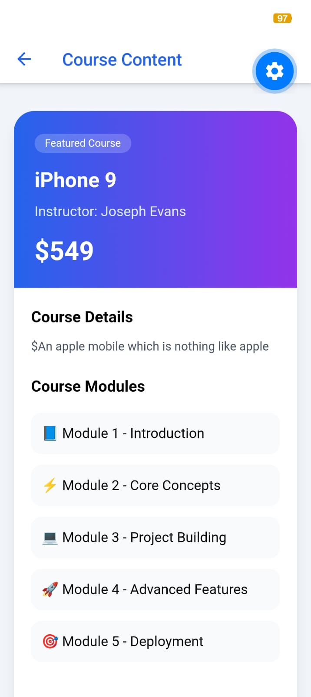
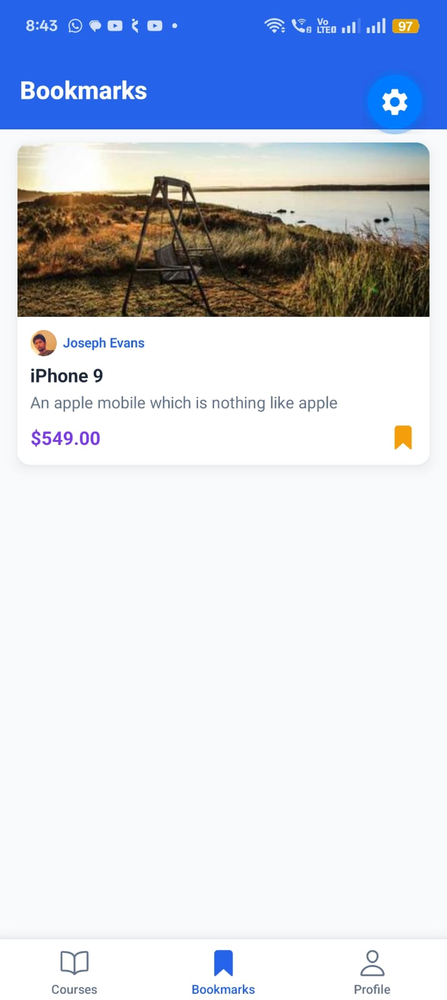
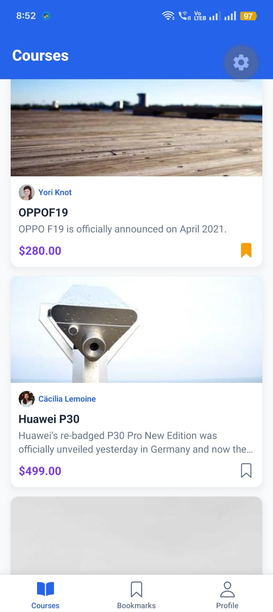

# 🎓 EduTech LMS

A mobile Learning Management System built with React Native (Expo Router) — browse courses, track learning streaks, and view course content in-app, all wrapped in a small, offline-aware, TypeScript codebase.

<p>
  
  
  
  
  
</p>

> Built as an internship assignment submission for **Ada Lovelace Technologies LLP**.

---

## 📋 Table of Contents

- [About](#-about)
- [Features](#-features)
- [Screenshots](#-screenshots)
- [Tech Stack](#️-tech-stack)
- [Getting Started](#-getting-started)
- [Findings — Bugs, UX Issues & Feasible Solutions](#-findings--bugs-ux-issues--feasible-solutions)
- [Resolved Issues](#-resolved-issues)
- [New Feature — Learning Streak & Achievements](#-new-feature--learning-streak--achievements)
- [Project Structure](#-project-structure)
- [Known Limitations](#-known-limitations)
- [License](#-license)

---

## 📖 About

EduTech LMS is a "Mini LMS" mobile app that lets a learner register/log in, browse a public course catalog (with search and category filtering), bookmark and enroll in courses, and open the actual course content inside an in-app WebView. It layers in a few production-style concerns that are easy to skip in a demo app — an offline banner that reacts to real connectivity changes, retry/timeout handling on every network request, local notifications, and a lightweight streak/gamification system — while keeping the codebase small enough to review end-to-end.

The app talks to the public [freeapi.app](https://api.freeapi.app) API for auth and course data, and to the Google Gemini API for AI-generated course insights.

---

## 🎓 Features

- **Authentication** — Register/Login with JWT, auto-login on app restart, tokens stored in `expo-secure-store`
- **Course Catalog** — Browse courses from freeapi.app with search, category filtering, and pull-to-refresh
- **AI Insights** — Gemini-generated summary, learning outcomes, and suitability notes on the course detail screen
- **Bookmarks** — Save courses locally (AsyncStorage); a notification fires once 5+ courses are bookmarked
- **Enroll** — Enroll in a course with immediate visual feedback
- **In-App Course Content (WebView)** — Course content viewer with Native ↔ WebView messaging
- **Profile** — View user info, stats, and (new) the learning streak card
- **Offline Banner** — Detects and displays a no-connection state via `@react-native-community/netinfo`
- **Notifications** — Local reminder if the app hasn't been opened in 24 hours, plus streak-milestone celebrations
- **Learning Streak & Achievements** *(new feature — see below)* — daily-open streak tracking with milestone badges
- **Resilient Networking** — Built-in retry logic, request timeout, and user-friendly error messages on every API call

---

## 📱 Screenshots

| | | |
|---|---|---|
|  |  |  |
| **Splash Screen** | **Login** | **Register** |
|  |  |  |
| **Course Catalog** | **Course Details** | **Course Content (WebView)** |
|  |  |  |
| **Bookmarks** | **Offline Banner** | **Profile** |
|  | | |
| **Notifications** | | |

---

## 🛠️ Tech Stack

| Library | Purpose |
|---|---|
| **Expo SDK 56** | Core React Native runtime, tooling, and native modules |
| **Expo Router** | File-based navigation (`app/` directory drives routes) |
| **TypeScript (strict)** | Type safety across the app |
| **NativeWind + Tailwind CSS** | Utility-first styling on top of React Native |
| **React Context + useReducer** (`store/`, `providers/`) | App state for auth and course data — no external state library |
| **React Hook Form + Zod** | Form handling and schema validation (login/register) |
| **Expo SecureStore** | Secure storage for JWT/refresh tokens |
| **AsyncStorage** | Local persistence for bookmarks, enrollments, streaks, and profile photo |
| **Expo Image** | Optimized, caching-aware image rendering |
| **Expo Linear Gradient** | Gradient accents used across the redesigned UI |
| **Expo Notifications** | Local notifications (inactivity reminder, streak milestones, bookmark milestone) |
| **@react-native-community/netinfo** | Real-time network/connectivity detection for the offline banner |
| **react-native-webview** | In-app rendering of course content |
| **@google/genai (Gemini)** | AI-generated course insights on the detail screen |
| **freeapi.app** | Public demo REST API for auth and course/instructor data |

---

## 🚀 Getting Started

### Prerequisites

- Node.js (LTS recommended) and npm
- [Expo CLI](https://docs.expo.dev/get-started/installation/) (via `npx`, no global install required)
- Expo Go app **or** an Android/iOS emulator for running the app
- A Google Gemini API key (for the AI Insights feature)

### Installation

```bash
# Clone the repository
git clone <repository-url>
cd Edutech-app

# Install dependencies
npm install
```

### Environment Variables

Create a `.env` file in the project root with the following keys (see `constants/api.ts` and `utils/ai.ts` for where they're consumed):

```env
EXPO_PUBLIC_BASE_URL=
EXPO_PUBLIC_GEMINI_API_KEY=
```

> ⚠️ Never commit real API keys to version control. Use your own values locally.

### Running the App

```bash
# Start the Expo dev server
npx expo start

# Run directly on Android
npx expo start --android

# Run directly on iOS
npx expo start --ios
```

### API Endpoints Used

| Purpose | Endpoint |
|---|---|
| Register | `POST /api/v1/users/register` |
| Login | `POST /api/v1/users/login` |
| Logout | `POST /api/v1/users/logout` |
| Current User | `GET /api/v1/users/current-user` |
| Courses | `GET /api/v1/public/randomproducts` |
| Instructors | `GET /api/v1/public/randomusers` |

### Building an APK

```bash
# EAS cloud build
npx eas login
npx eas build --platform android --profile development

# Local build
npx expo prebuild
cd android
./gradlew assembleDebug
# Output: android/app/build/outputs/apk/debug/app-debug.apk
```

---

## 🐛 Findings — Bugs, UX Issues & Feasible Solutions

> These are the limitations and issues identified while reviewing the codebase as part of this assignment.

| # | Issue | Impact | Feasible Solution |
|---|---|---|---|
| 1 | **Thumbnail mismatch/flicker** *(fixed — see [Resolved Issues](#-resolved-issues))*. `CourseCard` generated a brand-new random image on every render, and the detail screen generated a second, different random image for the same course. | List and detail views almost never showed the same thumbnail, and the image changed on every scroll/refresh. | Derive the thumbnail once per course from `course.id`/`course.thumbnail` via a memoized helper, shared by both screens. |
| 2 | **Avatar resets on app restart** *(fixed — see [Resolved Issues](#-resolved-issues))*. The picked profile avatar only lived in component state. | Users had to re-pick their profile photo every time the app restarted. | Persist the picked URI to AsyncStorage and reload it on mount. |
| 3 | **No pagination on the course catalog.** `fetchCourses(page=1, limit=20)` always requests page 1 with a hardcoded limit. | Only the first 20 courses are ever reachable regardless of scrolling, and search only searches within that same 20. | Add `onEndReached` infinite-scroll in the `FlatList`, incrementing `page` and appending results; keep search working against the full loaded set. |
| 4 | **API key handling in documentation.** A live-looking Gemini API key had previously been checked into the README. | Real credential-leak risk if the repo is public. | Keep keys only in `.env` (already how the code loads them), never in docs, and rotate any key that was ever committed. |
| 5 | **Course content WebView depends on a personal third-party GitHub Pages URL** and forwards the user's JWT as a request header to it. | If that page goes down, "View Course Content" breaks app-wide; forwarding a live auth token to a static third-party page is unnecessary exposure. | Host the course-content viewer on an owned domain, and only pass the minimum non-sensitive data needed (drop the `Authorization` header if the page doesn't need authenticated calls). |
| 6 | **`expo-image-picker`'s `MediaTypeOptions` API is deprecated** in favor of `MediaType` on newer SDK lines. | Will start throwing warnings/errors on future Expo SDK upgrades. | Swap to the non-deprecated `MediaType.Images` enum. |
| 7 | **Bookmarks tab can appear inconsistent with the catalog** once pagination (#3) is added, since it filters bookmarked IDs against only the currently-loaded `courses` array. | A bookmarked course could disappear from the Bookmarks tab if it fell off the loaded page. | Store full bookmarked course objects (not just IDs) so bookmarks remain visible regardless of what's currently loaded. |

---

## ✅ Resolved Issues

**#1 — Thumbnail mismatch/flicker.**
- **What was wrong:** `CourseCard` and the course detail screen each generated their own random placeholder image on render, so the same course showed different thumbnails in different places, and the image changed on every re-render.
- **What changed:** Added `utils/thumbnail.ts` exposing a single `getStableThumbnail()`, used by both `CourseCard` and the course detail screen, memoized on `course.id`. It prefers the real `course.thumbnail` from the API when it's a valid URL, and otherwise falls back to a placeholder image *seeded by the course id* (not `Math.random()`) — so the same course always shows the same image everywhere, with no flicker on re-render.

**#2 — Avatar resets on app restart.**
- **What was wrong:** The picked profile photo lived only in component state, so it disappeared the moment the app was killed and reopened.
- **What changed:** The picked profile photo is now saved to AsyncStorage and restored on launch, alongside the existing auth/bookmark persistence pattern already used elsewhere in `store/`.

---

## ⭐ New Feature — Learning Streak & Achievements

Extends the existing bookmark-notification and profile features into a small gamification layer.

**Purpose:** the app already nudges users back with a generic "haven't opened the app" notification; a visible streak gives a positive, personal reason to return daily instead of a passive reminder, and a badge row gives learners a built-in sense of progress the app didn't previously have.

**How it works:**
- `utils/streak.ts` tracks daily app opens (using the local calendar day, not UTC) and computes the current streak, longest streak, and progress to the next milestone (3 / 7 / 14 / 30 / 60 / 100 days).
- On app launch (`app/_layout.tsx`), a day is recorded once per session via `recordDailyActivity()`, which compares today's date to the last recorded active date in AsyncStorage: the same day is a no-op, exactly one day later increments the streak, and any bigger gap resets it to 1. The new current/longest streak is then persisted.
- Crossing a milestone fires a celebratory local notification via `utils/notifications.ts`.
- `components/StreakCard.tsx` renders a card on the Profile tab: a flame icon that changes color as the streak heats up, a progress bar to the next badge, and a row of earned/unearned trophy badges for each milestone. The Profile screen reads this state via `getStreakState()`.

**Built on top of:** the existing Profile screen and the existing local-notifications utility (`utils/notifications.ts`), reusing the same AsyncStorage persistence pattern already used for bookmarks and enrollments.

---

## 📁 Project Structure

```
app/
  (auth)/        # Login & register screens
  (tabs)/        # Main tabs: course catalog, bookmarks, profile
  course/[id]    # Course detail screen
  webview.tsx    # In-app WebView for course content

components/      # CourseCard, SearchBar, CategoryFilter, FeaturedBanner, OfflineBanner, StreakCard
providers/       # AuthProvider, CourseProvider — wire Context state into the component tree
store/           # authStore, courseStore — Context + persistence helpers (AsyncStorage/SecureStore)
utils/           # api client (fetch + retry), notifications, streak logic, thumbnail helper, Gemini (ai.ts)
constants/       # API endpoints, color palette
hooks/           # useNetworkStatus
screenshots/     # App screenshots used in this README
```

---

## ⚠️ Known Limitations

- Gemini AI summary may occasionally fail when the Gemini server is busy or request limits are reached.
- Profile image update is simulated locally since there is no backend for uploading/updating profile images.
- Course thumbnail and profile avatar images fall back to demo/placeholder images because the underlying product API doesn't always return reliable image URLs.
- Since the app uses freeapi.app as an external demo API, user persistence/session behavior isn't always production-grade — after logout, login can sometimes show `"User does not exist"`, requiring re-registration.

---

## 📄 License

This project is licensed under the **MIT License** — see [LICENSE](./LICENSE) for details.
